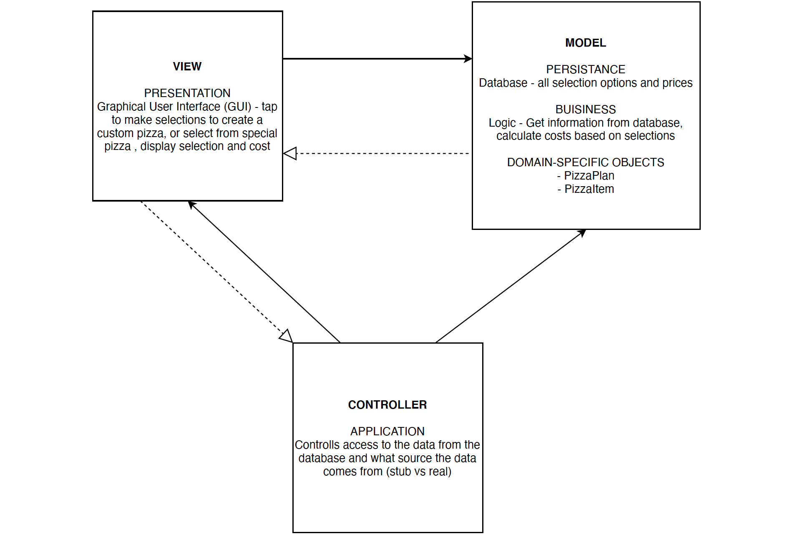
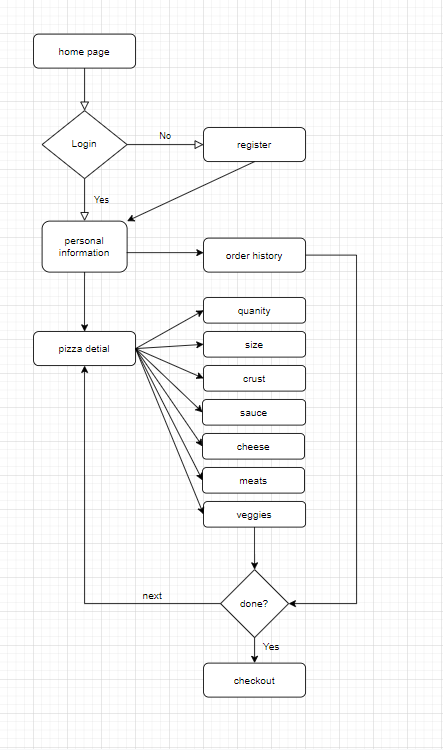
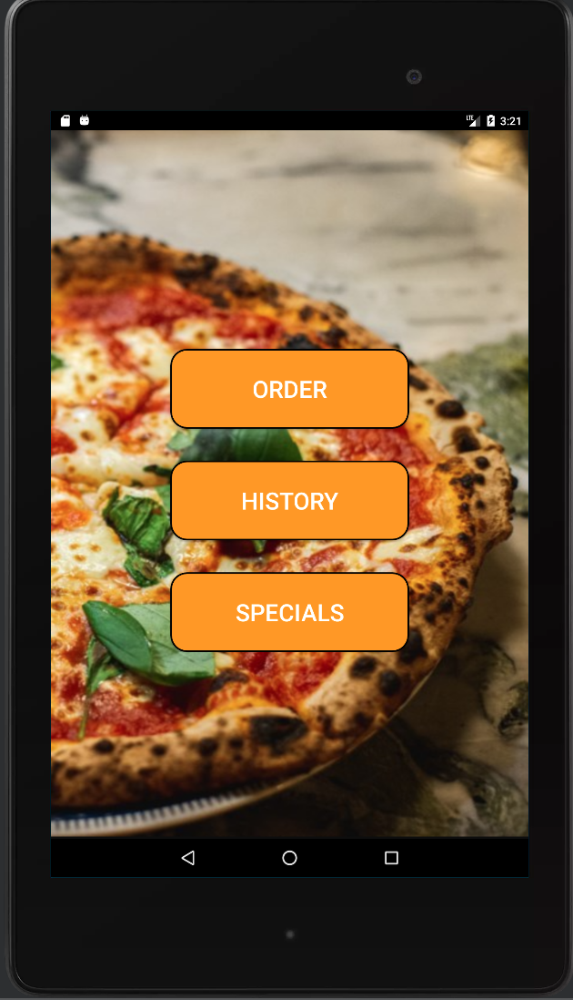
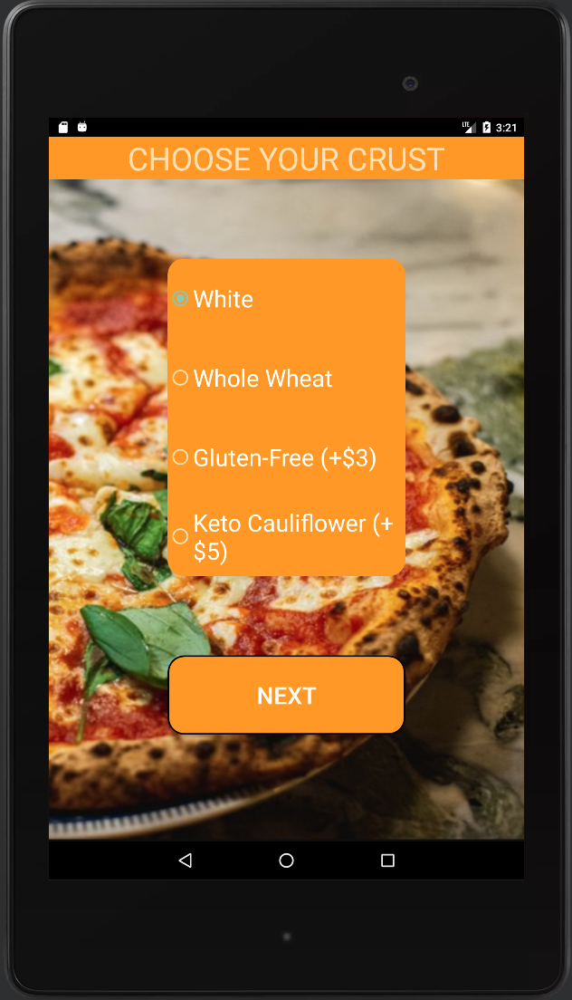
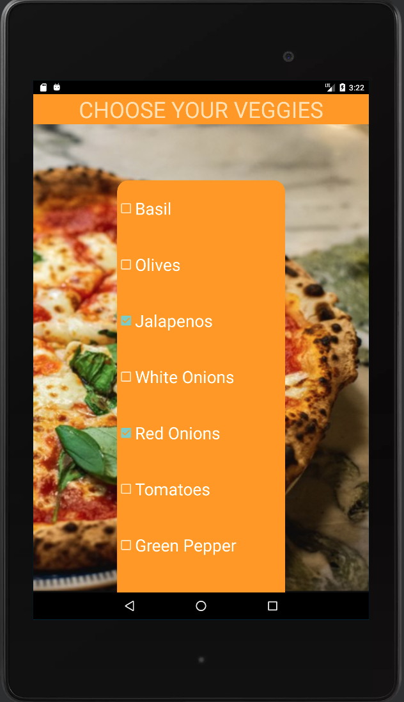
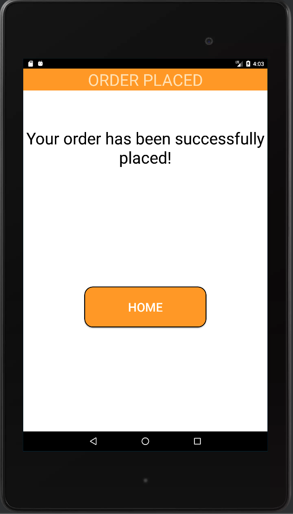
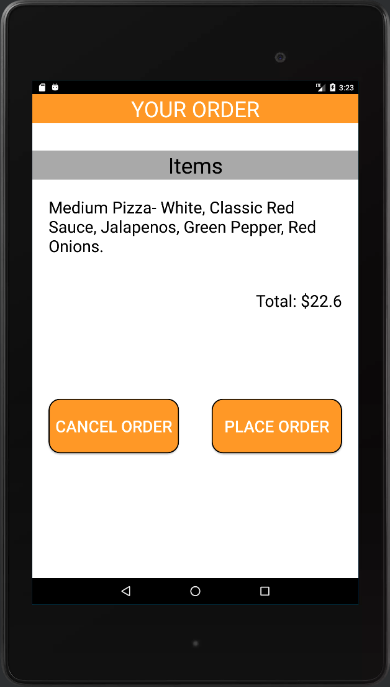
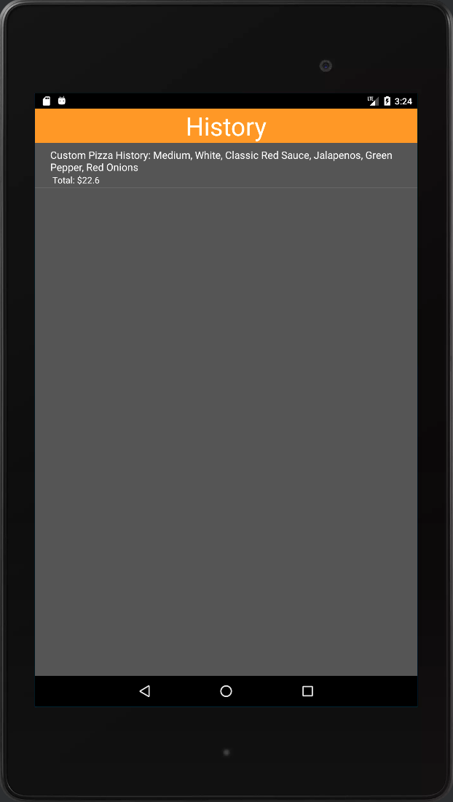

## Overview:
This Android app allows users to order pizza from a selection of items and uses an MVC architecture. The app has been tested on emulator on Windows, Nexus 7 running Android 6.0, with API 23 and has passed unit, integration and acceptance tests to ensure its functionality.

## Architecture:
The app is designed using an MVC structure with Model, View, and Controller components. The Model layer manages and accesses data, utilizing a DataAccessObject class for data stored in HSQLDB. The View layer is made up of Android Activities and Fragments, while the Controller layer contains classes that manage user input and application logic, including calculating order totals and displaying order summaries. As shown below.

## Installation:
To install the app, download the APK file and install it on a Windows, Nexus 7 running Android 6.0, or using an emulator. 

## Usage:
Once installed, users can launch the app from their device’s launcher. The app will present a list of available pizza items to choose from, and users can add items to their cart, proceed to checkout, and submit their order. Upon submission, the app displays a confirmation screen and returns to the item selection screen, allowing users to make additional orders. See photo below.

## Contributing:
We welcome contributions to the app. To contribute, submit a pull request with proposed changes that follow the established coding standards and undergo thorough testing. Before submitting, ensure any added code is properly commented and documented.

## License:
This app is open-source software distributed under the MIT license. For more information, refer to the LICENSE file included with the app.

## Demo:

